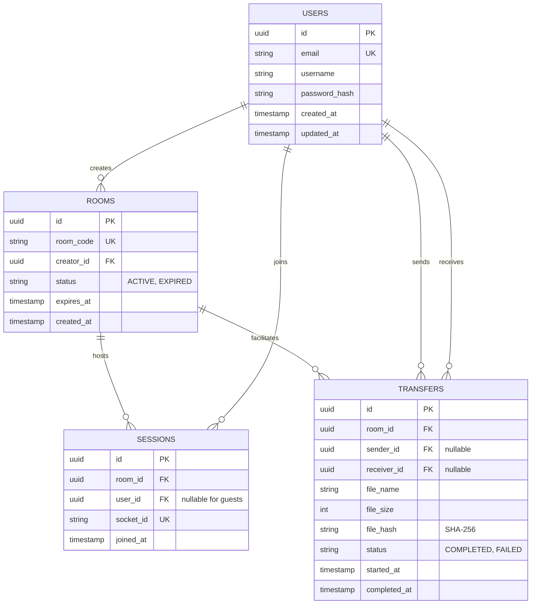

```mermaid
erDiagram
    USERS {
        uuid id PK
        string email UK
        string username
        string password_hash
        timestamp created_at
        timestamp updated_at
    }

    ROOMS {
        uuid id PK
        string room_code UK
        uuid creator_id FK
        string status "ACTIVE, EXPIRED"
        timestamp expires_at
        timestamp created_at
    }

    SESSIONS {
        uuid id PK
        uuid room_id FK
        uuid user_id FK "nullable for guests"
        string socket_id UK
        timestamp joined_at
    }

    TRANSFERS {
        uuid id PK
        uuid room_id FK
        uuid sender_id FK "nullable"
        uuid receiver_id FK "nullable"
        string file_name
        int file_size
        string file_hash "SHA-256"
        string status "COMPLETED, FAILED"
        timestamp started_at
        timestamp completed_at
    }

    USERS ||--o{ ROOMS : "creates"
    ROOMS ||--o{ SESSIONS : "hosts"
    USERS ||--o{ SESSIONS : "joins"
    ROOMS ||--o{ TRANSFERS : "facilitates"
    USERS ||--o{ TRANSFERS : "sends"
    USERS ||--o{ TRANSFERS : "receives"
```
