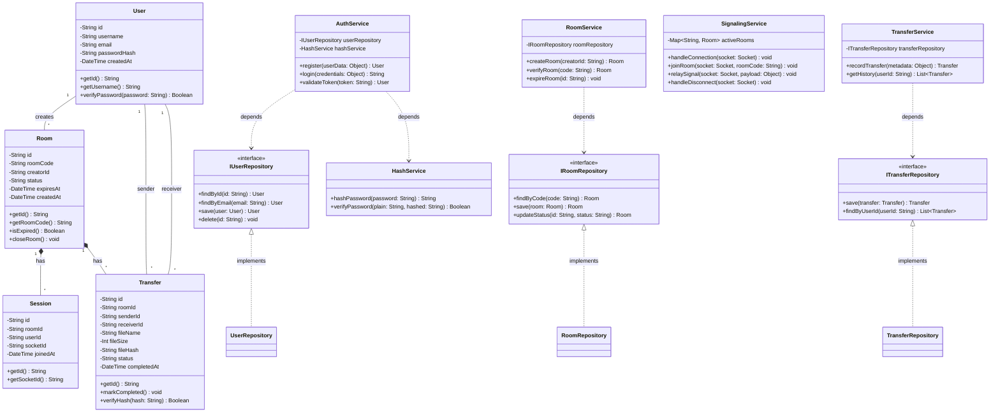

```mermaid
classDiagram
    %% Entities
    class User {
        -String id
        -String username
        -String email
        -String passwordHash
        -DateTime createdAt
        +getId() String
        +getUsername() String
        +verifyPassword(password: String) Boolean
    }

    class Room {
        -String id
        -String roomCode
        -String creatorId
        -String status
        -DateTime expiresAt
        -DateTime createdAt
        +getId() String
        +getRoomCode() String
        +isExpired() Boolean
        +closeRoom() void
    }

    class Session {
        -String id
        -String roomId
        -String userId
        -String socketId
        -DateTime joinedAt
        +getId() String
        +getSocketId() String
    }

    class Transfer {
        -String id
        -String roomId
        -String senderId
        -String receiverId
        -String fileName
        -Int fileSize
        -String fileHash
        -String status
        -DateTime completedAt
        +getId() String
        +markCompleted() void
        +verifyHash(hash: String) Boolean
    }

    %% Interfaces and Repositories
    class IUserRepository {
        <<interface>>
        +findById(id: String) User
        +findByEmail(email: String) User
        +save(user: User) User
        +delete(id: String) void
    }

    class IRoomRepository {
        <<interface>>
        +findByCode(code: String) Room
        +save(room: Room) Room
        +updateStatus(id: String, status: String) Room
    }

    class ITransferRepository {
        <<interface>>
        +save(transfer: Transfer) Transfer
        +findByUserId(userId: String) List~Transfer~
    }

    class UserRepository
    class RoomRepository
    class TransferRepository

    %% Services
    class AuthService {
        -IUserRepository userRepository
        -HashService hashService
        +register(userData: Object) User
        +login(credentials: Object) String
        +validateToken(token: String) User
    }

    class RoomService {
        -IRoomRepository roomRepository
        +createRoom(creatorId: String) Room
        +verifyRoom(code: String) Room
        +expireRoom(id: String) void
    }

    class SignalingService {
        -Map~String, Room~ activeRooms
        +handleConnection(socket: Socket) void
        +joinRoom(socket: Socket, roomCode: String) void
        +relaySignal(socket: Socket, payload: Object) void
        +handleDisconnect(socket: Socket) void
    }

    class TransferService {
        -ITransferRepository transferRepository
        +recordTransfer(metadata: Object) Transfer
        +getHistory(userId: String) List~Transfer~
    }

    class HashService {
        +hashPassword(password: String) String
        +verifyPassword(plain: String, hashed: String) Boolean
    }

    %% Relationships
    User "1" -- "*" Room : creates
    Room "1" *-- "*" Session : has
    Room "1" *-- "*" Transfer : has
    Transfer "*" -- "1" User : sender
    Transfer "*" -- "1" User : receiver

    IUserRepository <|.. UserRepository : implements
    IRoomRepository <|.. RoomRepository : implements
    ITransferRepository <|.. TransferRepository : implements

    AuthService ..> IUserRepository : depends
    AuthService ..> HashService : depends
    RoomService ..> IRoomRepository : depends
    TransferService ..> ITransferRepository : depends
```
