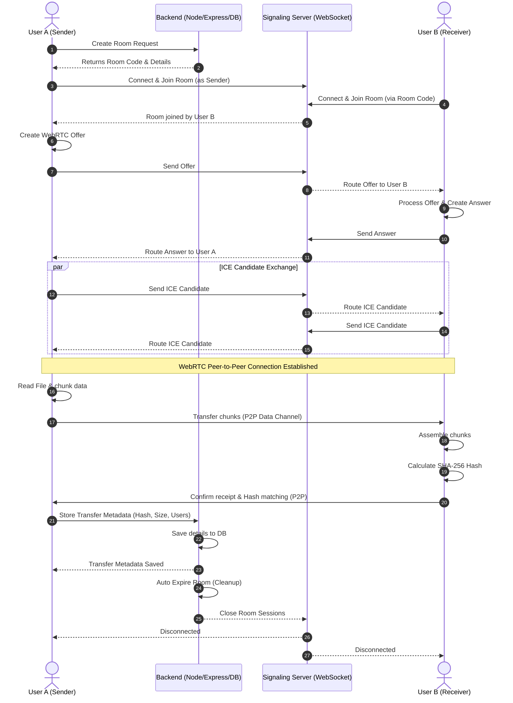

```mermaid
sequenceDiagram
    autonumber
    actor UserA as User A (Sender)
    participant Backend as Backend (Node/Express/DB)
    participant WS as Signaling Server (WebSocket)
    actor UserB as User B (Receiver)

    UserA->>Backend: Create Room Request
    Backend-->>UserA: Returns Room Code & Details
    
    UserA->>WS: Connect & Join Room (as Sender)
    UserB->>WS: Connect & Join Room (via Room Code)
    WS-->>UserA: Room joined by User B
    
    UserA->>UserA: Create WebRTC Offer
    UserA->>WS: Send Offer
    WS-->>UserB: Route Offer to User B
    
    UserB->>UserB: Process Offer & Create Answer
    UserB->>WS: Send Answer
    WS-->>UserA: Route Answer to User A
    
    par ICE Candidate Exchange
        UserA->>WS: Send ICE Candidate
        WS-->>UserB: Route ICE Candidate
        UserB->>WS: Send ICE Candidate
        WS-->>UserA: Route ICE Candidate
    end
    
    note over UserA, UserB: WebRTC Peer-to-Peer Connection Established
    
    UserA->>UserA: Read File & chunk data
    UserA->>UserB: Transfer chunks (P2P Data Channel)
    
    UserB->>UserB: Assemble chunks
    UserB->>UserB: Calculate SHA-256 Hash
    UserB->>UserA: Confirm receipt & Hash matching (P2P)
    
    UserA->>Backend: Store Transfer Metadata (Hash, Size, Users)
    Backend->>Backend: Save details to DB
    Backend-->>UserA: Transfer Metadata Saved
    
    Backend->>Backend: Auto Expire Room (Cleanup)
    Backend-->>WS: Close Room Sessions
    WS-->>UserA: Disconnected
    WS-->>UserB: Disconnected
```
