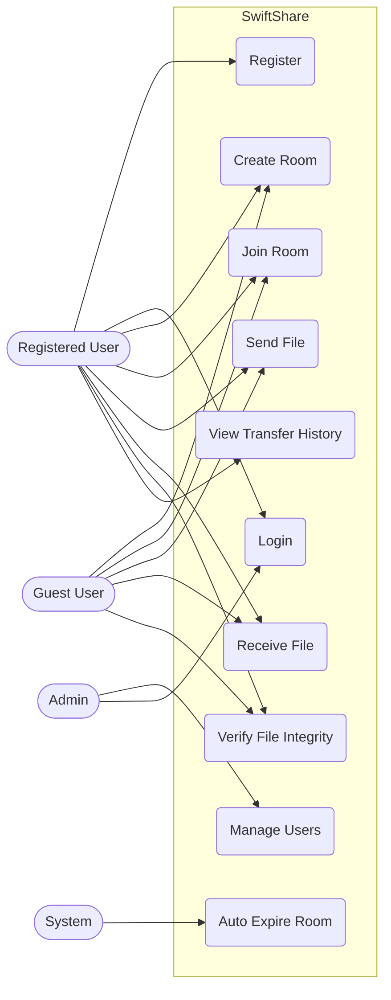

```mermaid
flowchart LR
    %% Actors
    Guest([Guest User])
    RegUser([Registered User])
    Admin([Admin])
    System([System])

    %% Use Cases
    subgraph SwiftShare
        Register(Register)
        Login(Login)
        CreateRoom(Create Room)
        JoinRoom(Join Room)
        SendFile(Send File)
        ReceiveFile(Receive File)
        ViewHistory(View Transfer History)
        AutoExpire(Auto Expire Room)
        VerifyIntegrity(Verify File Integrity)
        ManageUsers(Manage Users)
    end

    %% Relationships
    Guest --> CreateRoom
    Guest --> JoinRoom
    Guest --> SendFile
    Guest --> ReceiveFile
    Guest --> VerifyIntegrity
    
    RegUser --> Register
    RegUser --> Login
    RegUser --> CreateRoom
    RegUser --> JoinRoom
    RegUser --> SendFile
    RegUser --> ReceiveFile
    RegUser --> VerifyIntegrity
    RegUser --> ViewHistory

    Admin --> ManageUsers
    Admin --> Login
    
    System --> AutoExpire
```
